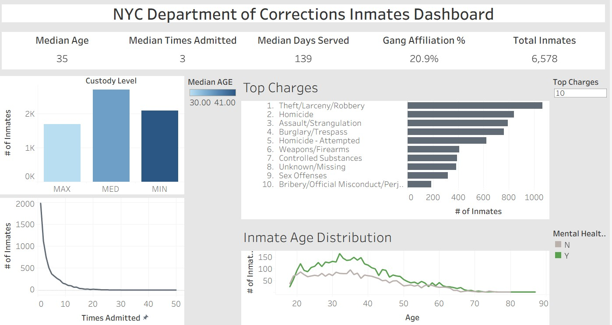
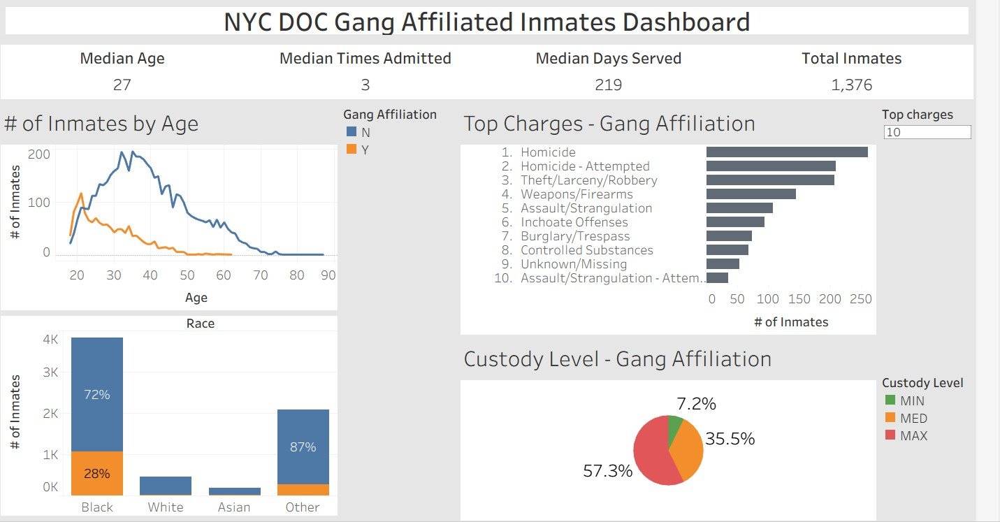

# NYC_DOC_inmates
Analysis of NYC Department of Corrections current inmates

This first dashboard gives an overview on the current inmate population in NYC jails.

The second dashboard provides more detail on gang affiliated inmates and allows for visual comparison between the general population and inmates who are gang affiliated.

## Data used:
### Inmate admissions data and inmate discharge data can be downloaded from the City of New York Open Data website
* [inmate admissions](https://data.cityofnewyork.us/Public-Safety/Inmate-Admissions/6teu-xtgp/about_data)
* [inmate discharges](https://data.cityofnewyork.us/Public-Safety/Inmate-Discharges/94ri-3ium/about_data)

### To download the exact dataset used in this analysis
* [admissions link](https://drive.google.com/file/d/19bhsiwHdO1tnm0dWvjbE3ZcMNvUEOAV2/view?usp=sharing)
* [discharges](https://drive.google.com/file/d/1b1H4DZqE0eaKMvo910uHd7zDhufUeA3H/view?usp=sharing)

### Criminal Codes:
* [DCJS Charge Code Manual download](https://www.criminaljustice.ny.gov/crimnet/ccman/ccman.htm)
